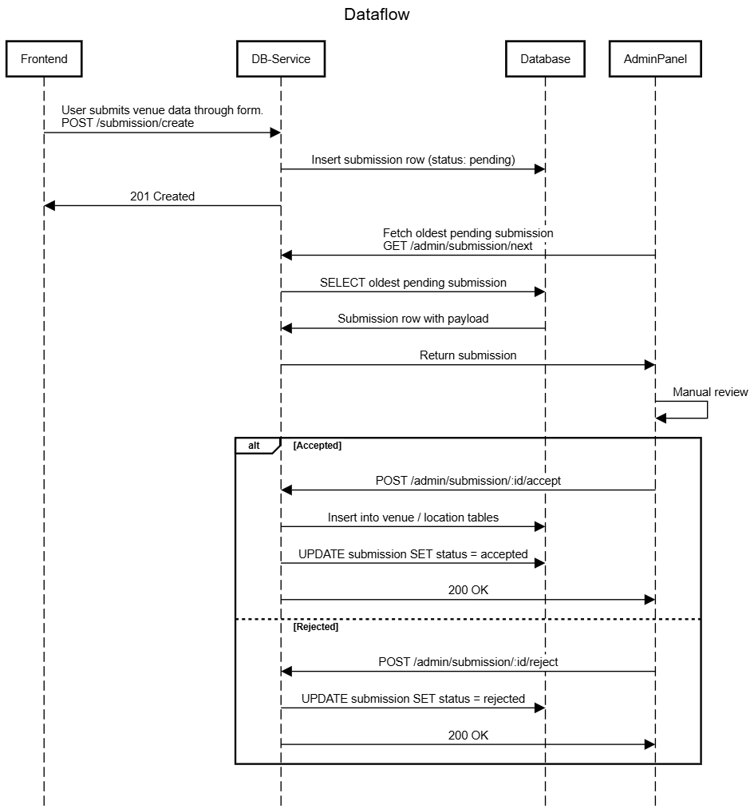

# Db-client

This services acts as a wrapper for the database, offering the following functionalitites.

- HTTP GET endpoints which the frontend will use to render bar, menu and location info.
- An endpoint which the frontend will use to create submissions out of crowd sourced data.
- Admin endpoints to handle the submission review process.

The endpoints are divided into client (frontend) facing endpoints and admin facing endpoints.

## Client Endpoints

### POST /submission/create

Used for creating a submission out of user data.
Requires a valid payload in the request body. These are defined in `/db-client/internal/models/api-request.go`

Example request body (venue submission):

```json
{
  "category": "venue",
  "payload": {
    "name": "Foobar",
    "street": "Borgarfjordsgatan 99",
    "area": "Kista",
    "city": "Stockholm",
    "country": "Sweden",
    "zip": "164 25",
    "lat": 59.4067,
    "lng": 17.9452
  }
}
```

Example request body (unit submission):

```json
{
  "category": "unit",
  "payload": {
    "venueID": "81451352-c86f-4c91-94d3-2e2bb396a586",
    "units": [
      {
        "name": "Heineken",
        "volume_ml": 330,
        "size": "",
        "unit_type": "beer",
        "price": 68,
        "currency": "sek",
        "abv": 5
      },
      {
        "name": "Jack daniels",
        "volume_ml": 40,
        "size": "",
        "unit_type": "whiskey",
        "price": 109,
        "currency": "sek",
        "abv": 40
      }
    ],
    "image": "BASE 64 ENCODING OF THE IMAGE"
  }
}
```

If the request is valid, this will respond with `status 201 Created`.

### GET /database/venue/{id}

Fetches all data relating to a venue and its location, based on an id.

Example request: `GET /database/venue/49295f5c-e408-4c30-b197-4154d98c15df`

Example Response:

```json
{
  "id": "49295f5c-e408-4c30-b197-4154d98c15df",
  "name": "Foobar",
  "location": {
    "id": "bb86c03d-3c5c-4d15-9d6c-c13f8c09a7f8",
    "street": "Borgarfjordsgatan 99",
    "area": "Kista",
    "city": "Stockholm",
    "country": "Sweden",
    "zip": "164 25",
    "lat": 59.4067,
    "lng": 17.9452,
    "created_at": "2026-04-30T12:56:36.759637Z",
    "updated_at": "2026-04-30T12:56:36.759637Z",
    "deleted_at": null
  },
  "created_at": "2026-04-30T12:56:36.759637Z",
  "updated_at": "2026-04-30T12:56:36.759637Z"
}
```

## Admin Endpoints

### GET /admin/health

Verifies that the database connection is still alive, and responds with `"status": "ok"`.

### GET /admin/submission/next

Responds with the oldest, still pending, submission in the database.
The administration panel will mainly use this method to fetch the "next in line" submission for review. The response contains some metadata, like a userID, when it was submitted etc.

The most important parts of the response are the "category", and "payload".
The category tells the administration panel how to interpret the payload, as the structure depends entirely on the submission category. The payload is the actual data which will be inserted into the database if the submission is approved.

Example response:

```json
{
  "id": "674adbd4-0115-445e-bdb1-34294021519d",
  "submitted_by": "cc0b1984-8349-43f3-8fb6-a28df39c77e2",
  "category": "venue",
  "status": "pending",
  "payload": {
    "lat": 59.4067,
    "lng": 17.9452,
    "zip": "164 25",
    "area": "Kista",
    "city": "Stockholm",
    "name": "Foobar",
    "street": "Borgarfjordsgatan 99",
    "country": "Sweden"
  },
  "reviewed_at": null,
  "created_at": "2026-04-30T12:17:28.12947Z",
  "deleted_at": null
}
```

### GET /admin/submission/{id}

Responds with a submission, exactly like the above endpoint.
Returns the submission with the matching id, regardless of status pending/accepted/rejected.

Example call: `/admin/submission/674adbd4-0115-445e-bdb1-34294021519d`

### GET /admin/submission/{id}/image

Responds with the raw byte data of the image associated with the submission.

Instead of returning a json response like the other endpoints, this one writes the raw image data straight into the response object. This means that the admin panel can simply use the url as the image soruce, without having to deal with manual rendering.
Example:

```
/image`}
      alt="Submission"
/>
```

**NOTE**: Only submissions with category "unit" have images.

### GET /admin/submission/list?status=Argument

Responds with a list of all submissions that match the status filter parameter. The endpoint can be called without filtering status.

Usage:

Fetch all submissions, regardless of review status:
`/admin/submission/list`

Fetch all pending submissions:
`/admin/submission/list?status=pending`

Fetch all accepted submissions:
`/admin/submission/list?status=accepted`

Fetch all rejected submissions:
`/admin/submission/list?status=rejected`

**NOTE:** The submissions returned by this endpoint do not include the actual payload data, but does include all other metadata. To recieve the payload for reviewing, you must fetch an individual submission either by id or with the `/admin/submission/next` endpoint.

### POST /admin/submission/{id}/accept

Marks a submission with the given id as accepted, this tells the submission service to update the submission and insert the payload into the relevant tables.

Usage: `admin/submission/674adbd4-0115-445e-bdb1-34294021519d/accept`

Response: `status 200 OK`

### POST /admin/submission/{id}/reject

Marks a submission with the given id as rejected, the submission service will update the submission status and will not insert any data.

Usage: `admin/submission/674adbd4-0115-445e-bdb1-34294021519d/accept`

Response: `status 200 OK`

## Data flow, from user input to database insertion



## Project Structure

### DB

The DB package contains the database client, which does nothing other than maintain the database connection and expose it to other packages.

### Handlers

HTTP handlers

### Services

Contains the submission service. This service uses domain knowledge of submission request types to verify that submissions are valid before they are inserted, and also orchestrates different stores to handle insertions when a submission is approved/rejected by an admin.

### Stores

Contains stores like venueStore, locationStore etc. These structs own all direct communication with the database. They serve as an abstraction layer so that we dont mix http logic, business logic and sql queries.

### Models

Contains definitions of struct types used everywhere in the project.

It defines:

- Golang representations of database tables
- Expected HTTP request bodies
- The json types which will be returned to the caller (frontend / admin panel)

## Build

Create the docker image with `docker build -t db-client .`

Run the container with `docker run --env-file .env -p 8081:8081 db-client`

Requires a .env file with SUPABASE_CONN_STRING, as well as TEST_USER_UUID.

SUPABASE_CONN_STRING is the string used to connect to the remote database.

TEST_USER_UUID a temporary solution to the fact the we don't have a functioning auth middleware yet. Every request to `/submission/create/` must include a userID, or some way to connect the submission to a registered user. Otherwise the frontend will receive an authentication error.
Instead of looking for an authentication key in the request, the handler now searches for a local enviromnent variable called TEST_USER_UUID. To create your own, go to our project on supabase, go to authentication, and create a user with your email. This will give you a user ID, which you can put in your own local .env.
